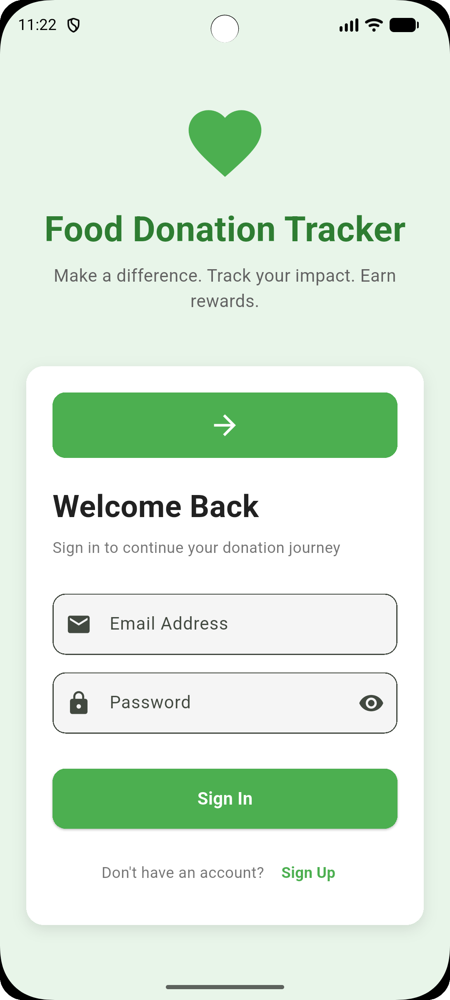
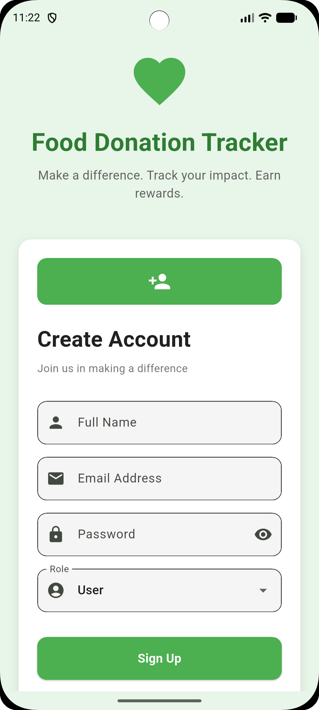
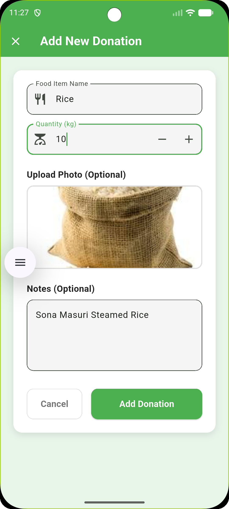
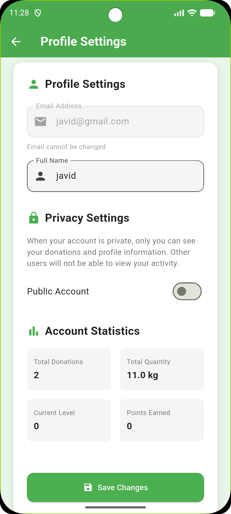
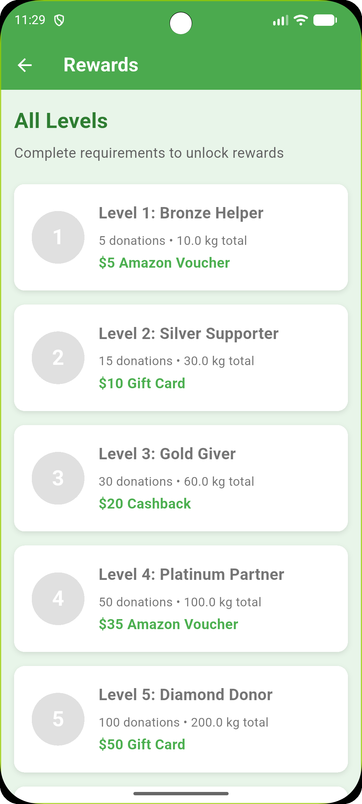
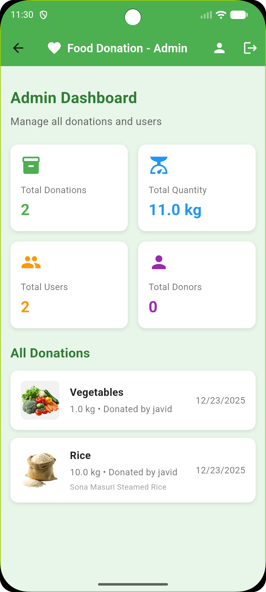
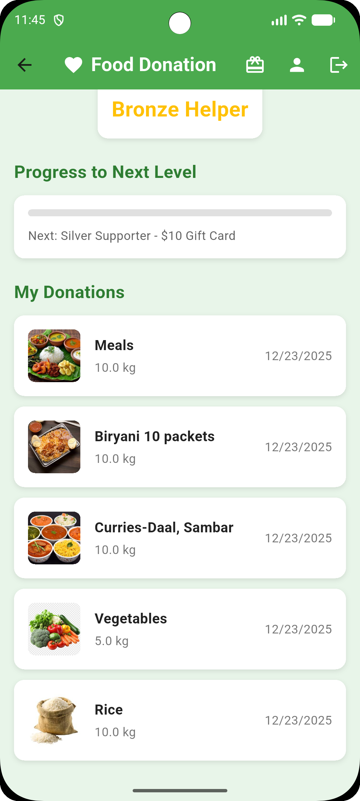

# 🍽️ Food Donation Tracker

A comprehensive Flutter application for managing food donations with role-based access control, donation tracking, and reward systems.

## 📋 Project Description

Food Donation Tracker is a mobile application designed to help individuals and organizations track their food donations, monitor their impact, and earn rewards for their contributions. The app supports multiple user roles (Admin, User, Donor) with tailored dashboards and features for each role.

The application uses local storage (Hive and SharedPreferences) for data persistence, making it fully functional offline while maintaining a modern, responsive UI that adapts to all device sizes.

## ✨ Features

### 🔐 Authentication & User Management
- **Secure Login System**: Email and password-based authentication
- **User Registration**: Sign up with role selection (Admin, User, Donor)
- **Session Management**: Persistent login sessions using SharedPreferences
- **Profile Management**: Update profile information and privacy settings

### 👥 Role-Based Dashboards
- **Admin Dashboard**: 
  - View all donations across the platform
  - Monitor total users and donors
  - Access comprehensive statistics
  - Manage platform-wide data

- **User Dashboard**:
  - Track personal donations
  - View donation history
  - Monitor progress toward reward levels
  - Access account statistics

- **Donor Dashboard**:
  - Manage donation records
  - Track contribution impact
  - View reward progress
  - Access donation history

### 📦 Donation Management
- **Add Donations**: Record food donations with details
  - Food item name
  - Quantity in kilograms
  - Optional photo upload
  - Additional notes
- **Donation History**: View all past donations with dates
- **Statistics Tracking**: Monitor total donations and quantities

### 🏆 Reward System
- **6 Reward Levels**: From Bronze Helper to Elite Champion
- **Progress Tracking**: Visual progress bars showing advancement
- **Level Requirements**: Clear goals for each reward tier
- **Reward Details**: View available rewards for each level

### 🎨 User Interface
- **Responsive Design**: Adapts to mobile, tablet, and desktop screens
- **Modern UI**: Clean, green-themed interface inspired by food donation concepts
- **Intuitive Navigation**: Easy-to-use navigation between screens
- **Image Support**: Upload and display donation photos

### 💾 Data Storage
- **Hive Database**: Efficient local storage for users and donations
- **SharedPreferences**: Lightweight storage for authentication state
- **Offline Support**: Fully functional without internet connection

## 🚀 Installation Steps

### Prerequisites
- Flutter SDK (3.10.1 or higher)
- Dart SDK
- Android Studio / Xcode (for mobile development)
- VS Code or Android Studio IDE

### Setup Instructions

1. **Clone the repository**
   ```bash
   git clone https://github.com/javid4962/food_donation_app.git
   cd food_donation_app
   ```

2. **Install dependencies**
   ```bash
   flutter pub get
   ```

3. **Run the application**
   ```bash
   flutter run
   ```

4. **Build for production**
   ```bash
   # Android APK
   flutter build apk --release
   
   # iOS (macOS only)
   flutter build ios --release
   
   # Web
   flutter build web
   ```

## 📁 Project File Structure

```
food_donation/
├── lib/
│   ├── main.dart                 # Application entry point
│   ├── models/
│   │   ├── user.dart            # User model with roles
│   │   ├── donation.dart        # Donation model
│   │   └── reward_level.dart    # Reward level definitions
│   ├── services/
│   │   ├── auth_service.dart    # Authentication logic
│   │   ├── donation_service.dart # Donation management
│   │   └── storage_service.dart # Hive & SharedPreferences
│   ├── screens/
│   │   ├── login_screen.dart    # Login page
│   │   ├── signup_screen.dart   # Registration page
│   │   ├── dashboard_screen.dart # Main dashboard router
│   │   ├── user_dashboard_screen.dart # User dashboard
│   │   ├── donor_dashboard_screen.dart # Donor dashboard
│   │   ├── admin_dashboard_screen.dart # Admin dashboard
│   │   ├── add_donation_screen.dart # Add donation form
│   │   ├── profile_screen.dart  # Profile settings
│   │   └── rewards_screen.dart  # Rewards overview
│   ├── widgets/
│   │   └── donation_image.dart # Image display widget
│   └── utils/
│       └── responsive.dart      # Responsive design utilities
├── android/                      # Android configuration
├── ios/                          # iOS configuration
├── web/                          # Web configuration
├── pubspec.yaml                  # Dependencies and metadata
└── README.md                     # This file
```

## 📦 Dependencies

### Core Dependencies
- **flutter**: SDK framework
- **hive**: ^2.2.3 - Fast, lightweight NoSQL database
- **hive_flutter**: ^1.1.0 - Hive integration for Flutter
- **shared_preferences**: ^2.2.2 - Simple key-value storage
- **path_provider**: ^2.1.1 - File system path utilities
- **image_picker**: ^1.0.7 - Image selection from gallery/camera
- **intl**: ^0.19.0 - Internationalization and date formatting
- **uuid**: ^4.5.2 - Unique identifier generation

### Dev Dependencies
- **flutter_test**: Testing framework
- **flutter_lints**: ^6.0.0 - Linting rules
- **hive_generator**: ^2.0.1 - Code generation for Hive
- **build_runner**: ^2.4.7 - Code generation runner

## 📱 App Overview

### User Roles

#### 👤 User
- Track personal food donations
- View donation history
- Monitor reward progress
- Update profile settings

#### 🎁 Donor
- All User features
- Enhanced donation tracking
- Donor-specific statistics

#### 👨‍💼 Admin
- View all platform donations
- Monitor total users and donors
- Access comprehensive analytics
- Platform-wide statistics

### Key Screens

1. **Login Screen**: Secure authentication with email and password
2. **Signup Screen**: User registration with role selection
3. **Dashboard**: Role-specific dashboard with statistics and recent donations
4. **Add Donation**: Form to record new food donations with optional photo
5. **Profile Settings**: Manage account information and privacy settings
6. **Rewards Screen**: View all reward levels and progress

### Data Flow

- **Authentication**: SharedPreferences stores login state
- **User Data**: Hive database stores user profiles
- **Donations**: Hive database stores donation records
- **Statistics**: Calculated in real-time from stored donations

## 📸 Screenshots

<div align="center">
  
  
  
  
  
  
  
  
</div>

*Note: Add your screenshots to the `screenshots/` folder with names ss1.png, ss2.png, etc.*

## 🔮 Upcoming Features

### Planned Enhancements
- [ ] **Cloud Sync**: Synchronize data across devices using Firebase
- [ ] **Push Notifications**: Notify users about new rewards and milestones
- [ ] **Social Sharing**: Share donation achievements on social media
- [ ] **Donation Categories**: Categorize donations (vegetables, grains, etc.)
- [ ] **Export Data**: Export donation history as PDF/CSV
- [ ] **Multi-language Support**: Support for multiple languages
- [ ] **Dark Mode**: Theme switching for better user experience
- [ ] **Donation Analytics**: Advanced charts and graphs for donation trends
- [ ] **QR Code Generation**: Generate QR codes for donation receipts
- [ ] **Location Tracking**: Add location data to donations
- [ ] **Donation Reminders**: Set reminders for regular donations
- [ ] **Achievement Badges**: Visual badges for milestones
- [ ] **Community Leaderboard**: Compare donations with other users
- [ ] **Donation Goals**: Set and track personal donation goals
- [ ] **Receipt Management**: Store and manage donation receipts

### Technical Improvements
- [ ] **Unit Tests**: Comprehensive test coverage
- [ ] **Integration Tests**: End-to-end testing
- [ ] **Performance Optimization**: Improve app performance
- [ ] **Accessibility**: Enhanced accessibility features
- [ ] **Error Handling**: Improved error handling and user feedback

## 🤝 Contributing

Contributions are welcome! Please feel free to submit a Pull Request.

## 📄 License

This project is licensed under the MIT License.

## 👤 Author

**Javid**
- GitHub: [@javid4962](https://github.com/javid4962)

## 🙏 Acknowledgments

- Flutter team for the amazing framework
- Hive for efficient local storage
- All contributors and testers

---

⭐ If you find this project helpful, please consider giving it a star!
